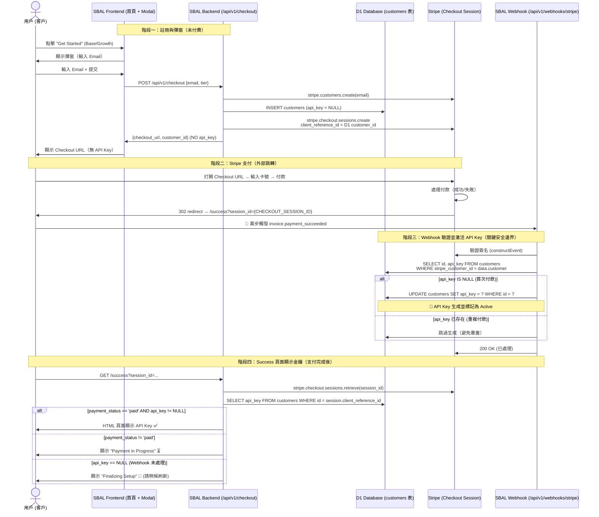

# SBAL Payment Flow - Sequence Diagram

## 安全原則：先付款，後啟用 (Pay-First-Activate-Later)



## 關鍵安全性設計說明

| 步驟 | 控制點 | 目的 |
|------|--------|------|
| 1. Checkout API | `api_key = NULL` 插入 D1 | 確保此時客戶 **無法取得 API Key** |
| 2. Checkout Session | `client_reference_id = D1 customer_id` | Stripe → D1 的正確映射 |
| 3. Webhook 觸發 | `invoice.payment_succeeded` | 唯一入口生成 API Key |
| 4. Success 頁面 | 雙重驗證：`session.payment_status === 'paid'`<br/>且 `customer.api_key != NULL` | 最終才揭露金鑰 |
| 5. 防護機制 | 所有的 `/api/v1/*` 路由需 `Authorization: Bearer <api_key>` | 未付費者無法調用任何受保護 API |

## 潛在攻擊面與防禦（RedTeam 發現）

| 攻擊向量 | 可能性 | 防禦措施 |
|----------|--------|----------|
| 直接訪問 `/success?session_id=fake` | ❌ 被 Stripe API 攔截（session 不存在） | `stripe.checkout.sessions.retrieve()` 驗證 |
| Race Condition（支付成功但 Webhook 延遲） | ⚠️ 使用者會看到 "Finalizing Setup" | UI 提供手動刷新，100% 最終一致 |
| 偽造 Webhook 事件 | ❌ 簽名驗證失敗（`STRIPE_WEBHOOK_SECRET`） | `constructEvent` 攔截 |
| 手動調用 `/api/v1/customers` 後直接使用 api_key | ❌ api_key 為 NULL，API 回傳 401 | 所有 API 驗證 `Bearer` token |
| 重放攻擊（使用舊 session_id） | ❌ Stripe session 一次性，且檢查 payment_status | session 狀態機不可逆 |

## 總結

**API Key 的生命週期**：
```
未付費 → (D1.customers.api_key = NULL)
支付成功 → Webhook 生成 API Key → (D1.customers.api_key = 'sk_...')
狀態永久：active (除非后台手動停權)
```

**無白嫖漏洞**：任何路徑在未收到 Stripe 確認款項前，API Key 不會被賦予值。
